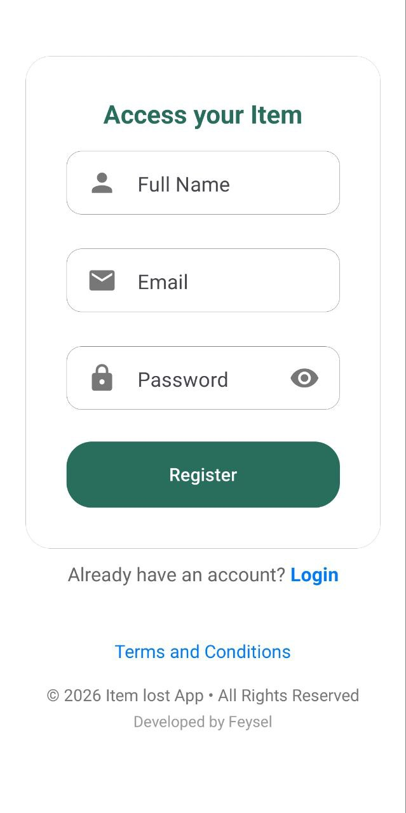
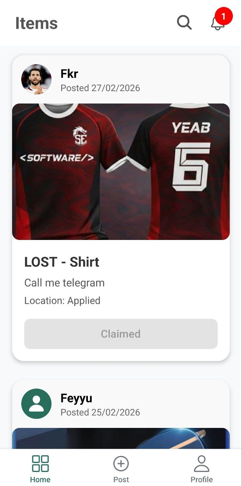
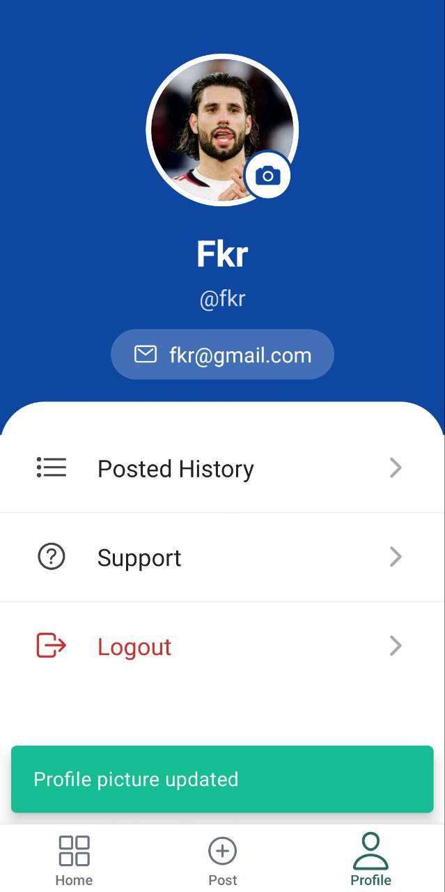
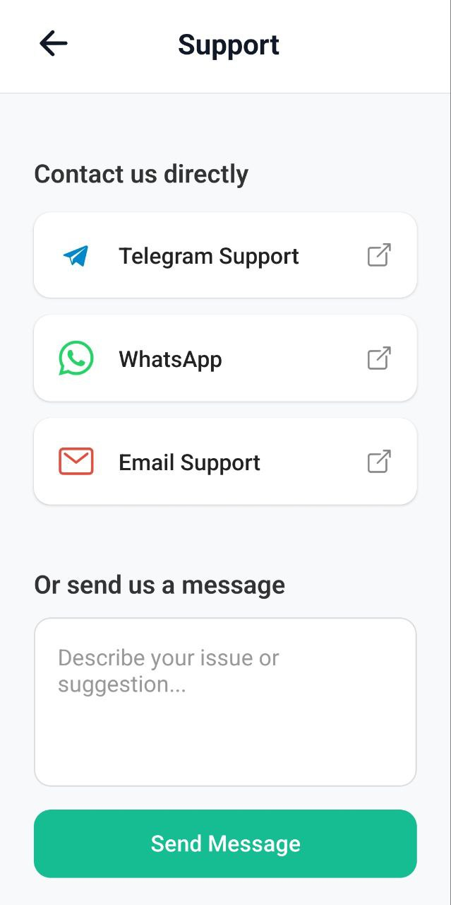
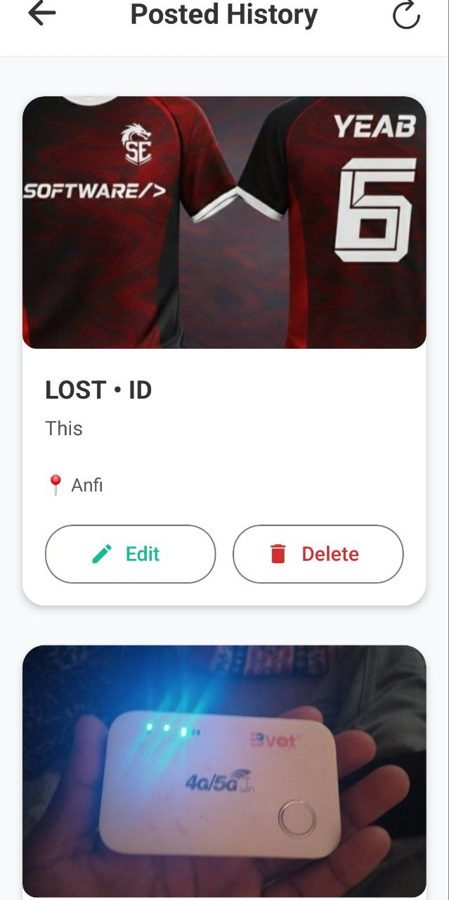

# 📦 Lost & Found Item Platform

A platform that connects people who **lost items** with people who **found them**, making it easier to recover lost belongings securely.

---

# 🚀 Features

## 👤 User Features

Users can:

- 🔐 **Sign up and log in securely**
- 📧 **Reset password via email verification**
- 📦 **Post lost or found items**
- 🔍 **Search for items**
- 📝 **Submit claims for found items**
- 🔔 **Receive notifications when claims are approved or rejected**
- ✏️ **Manage their own listings (edit/delete)**

---

## 🛠 Admin Features

Admins can:

- 📊 View **dashboard statistics**
- 📝 Review **claim requests with user details and ID photos**
- ✅ Approve claims
- ❌ Reject claims
- 📈 Monitor overall platform activity

---

# 🔔 Notifications

Users receive notifications when:

- ✅ Admin **approves** the claim
- ❌ Admin **rejects** the claim

---

# 🔐 Security & Verification

To prevent fraud and ensure item ownership:

- 📷 **ID photo required** when submitting a claim
- 👮 **Admin verification** before item release
- 🔒 **Controlled approval system**

---

# 📊 Admin Dashboard

The admin dashboard displays:

- 👥 Total Users
- 📦 Total Items
- ⏳ Pending Claims
- ✅ Approved Claims
- ❌ Rejected Claims
- 📝 Claim Management

### Claim Review Process

When a user submits a claim, the admin can:

- View item details
- View claimant information
- View uploaded ID photo
- Approve or reject the claim

---

# 🖥 Admin Dashboard Screenshots

### pending

### View User Details

## 

# 📱 Mobile App

Tested on a physical Android device.

**signup page**

**home page**

**profile page**

**support page**

**history page**

# ⚙️ Tech Stack

**Frontend**

- React (Admin dashboard)
- React Native (Mobile app)

**Backend**

- Node.js
- Express.js

**Database**

- MongoDB

**Authentication**

- JSON Web Token (JWT)

**Image Storage**

- Cloudinary

---

# 👨‍💻 Author

**Feysel Yassin**
Second Year Software Engineering Student
Adama Science and Technology University (ASTU)

**contact**
feysefeyyu@gmail.com
